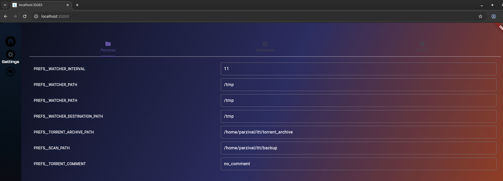
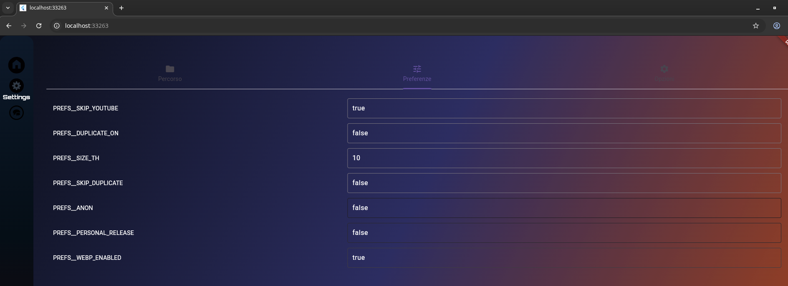
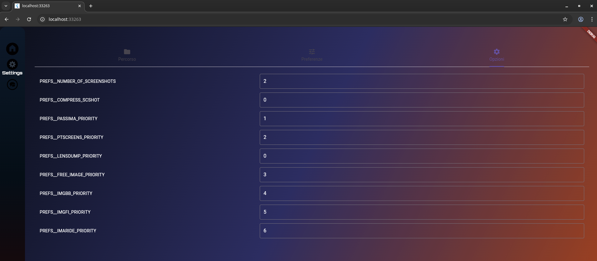
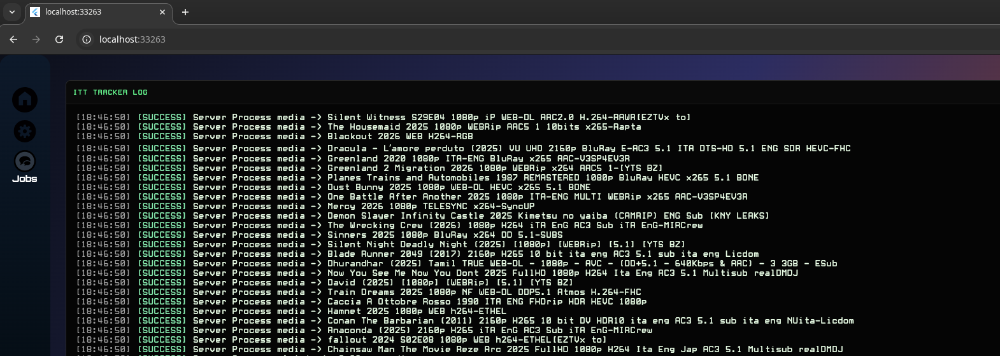

**Hi ! 2**
===============================================
|version| |online| |status| |python| |ubuntu| |debian| |windows|

.. |version| image:: https://img.shields.io/pypi/v/unit3dupWeb.svg
.. |online| image:: https://img.shields.io/badge/Online-green
.. |status| image:: https://img.shields.io/badge/Status-Active-brightgreen
.. |python| image:: https://img.shields.io/badge/Python-3.12+-blue
.. |ubuntu| image:: https://img.shields.io/badge/Ubuntu-22+-blue
.. |debian| image:: https://img.shields.io/badge/Debian-12+-blue
.. |windows| image:: https://img.shields.io/badge/Windows-11-blue

Auto Torrent Generator and Uploader
===================================

Reworked from the original Unit3Dup:
https://github.com/31December99/Unit3Dup

now including an async backend and a web frontend

.. image:: images/home.png
   :alt: Uni3D webUp home
   :width: 600
   :align: center

|

|

|

|

|

It performs the following tasks:

- Scan folder and subfolders
- Compiles various metadata information to create a torrent
- Extracts a series of screenshots directly from the video
- Add webp to your torrent description page
- Searches for the corresponding ID on TMDB,IMDB,TVDB
- Add trailer from TMDB or YouTube
- Seeding in qBittorrent
- Generates meta-info derived from the video
- Create and upload individual torrents or the page

*NOT YET TESTED*

- Extracts cover from the PDF documents
- Reseeding one or more torrents at a time
- Seed your torrents across different OS
- Add a custom title to your seasons
- Generate info for a title using MediaInfo
- unit3dup can grab the first page, convert it to an image (using xpdf),
  and then the bot can upload it to an image host, then add the link to the torrent page description.

*NOT YET IMPLEMENTED*

- Generates meta-info derived from the game
- Seeding in Transmission or rTorrent

# Install from docker hub
=========================

run
docker-compose pull

# How it works
===================

The backend comes with FastAPI endpoints.
For each video file, the uploader creates a job_id equal to the hash of its path

A list of job_ids forms the job_list, which corresponds to the page you can view.
For each page the uploader creates a job_list_id equal to the hash of the scan_path

For now, a WebSocket is used mainly to send progress updates while creating the torrent file,
or to send process logs to the frontend console.

When you run the scan, the uploader goes through the following process:

- Search for files or folder
- Extract the title and search on TMDb based on the category, either movie or series.
- Search on TVDB and extract IMDB ID from teh remote_ids field
- Create screenshots
- Create a description with mediainfo and screenshot

Once you see the poster on the page, the process is complete.
If there is an issue with the title or TMDb/TVDB/IMDb IDs, you can edit the individual poster by clicking on it.
By clicking on it, a window popup opens. You can then choose whether to edit fields, create a torrent, upload, or start seeding.
Alternatively, if you want to upload every video, you can click the icon button near the search box on the left

Since the backend is based on these endpoints, you can create your own frontend.
I didn’t want to rewrite the backend completely, so only the frontend was written in Dart,
while the backend was refactored to be async.
Every page is stored permanently in Redis, but you can also delete a page (remove it from Redis) if needed

If you delete or add files in the scan folder you need to click on scan again to update the page

# Build Frontend
===================

flutter pub get

flutter build web --release --wasm

# Build Container
===================

docker-compose build --no-cache -f build.yml

docker-compose up

# Docker HUB
====================

docker login

docker tag unit3dwebup-backend:latest parzival2025/backend_app:0.0.1

docker tag unit3dwebup-frontend:latest parzival2025/frontend_app:0.0.1

docker push parzival2025/backend_app:0.0.1

docker push parzival2025/frontend_app:0.0.1

work in progress..

